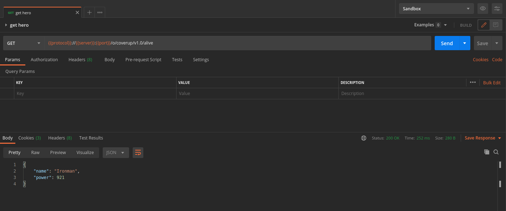
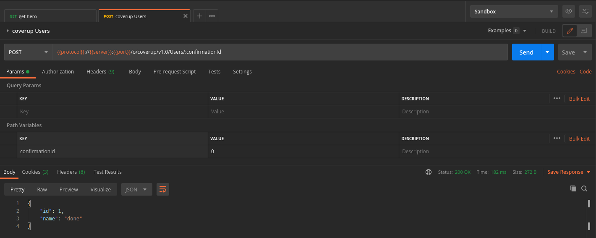

# DO NOT USE IN PRODUCTION ENVIRONMENT!!!

---
# Coverup

An example of a custom OpenAPI endpoint.





## How to Build and Deploy to Liferay

Follow the steps below to build and deploy or copy the modules from the [releases](../../releases/latest) page to your Liferay's deploy folder.

In order to build or deploy this module you will need to [install Blade CLI](https://help.liferay.com/hc/en-us/articles/360028833852-Installing-Blade-CLI).

### To Build

`$ blade gw build`

You can find the built modules at `modules/{module-name}/build/libs/{module-name}.jar`.

### To Deploy

In `gradle-local.properties` add the following line to point towards the Liferay instance you want to deploy to:
```
liferay.workspace.home.dir=/path/to/liferay/home
```

`$ blade gw deploy`

## Usage

[Adding Widgets to a Page.](https://learn.liferay.com/dxp/7.x/en/site-building/creating-pages/using-widget-pages/adding-widgets-to-a-page.html)

*Explain what's required to set up and make use of all of the projects features.*

### Features

* Feature One
    * 
* Feature Two
    * 
* Feature Three
    * 

*Wherever possible, include more images or gifs that explain the features of your project.*

## Issues & Questions Welcome
---
# Edit yaml
Use [Swagger Editor](editor.swagger.io)

# Test endpoint
`curl -X 'GET' 'http://localhost:8080/o/coverup/v1.0/alive'  -u 'test@liferay.com:test'`

`curl -X 'POST' 'http://localhost:8080/o/coverup/v1.0/{confirmationId}'  -u 'test@liferay.com:test'`
